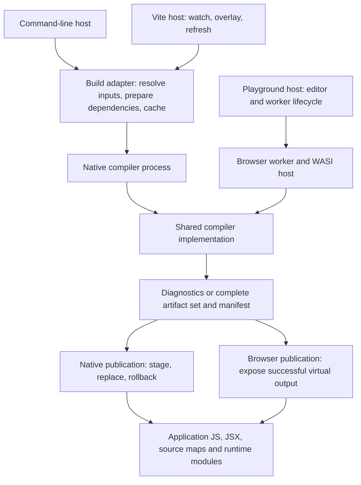
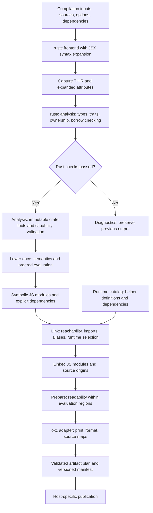
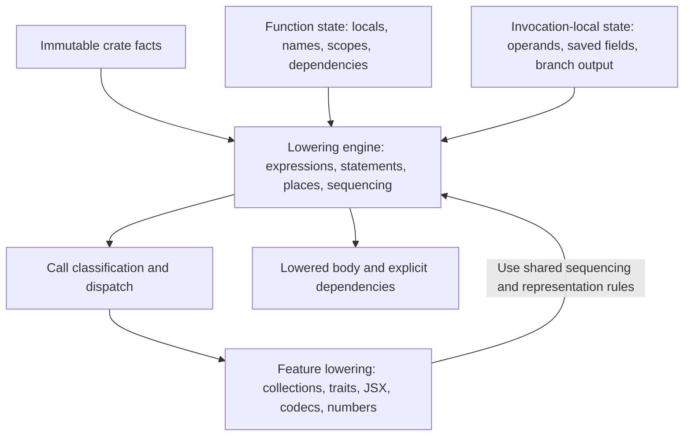
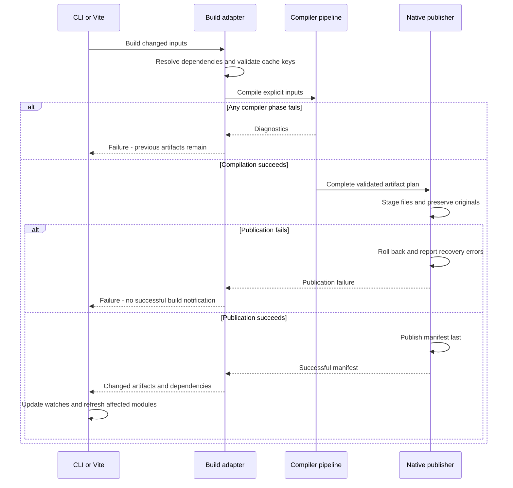

# Target architecture

**Rust in. Readable JavaScript out.**

This document describes the architecture we are working toward. It is a target,
not a claim that every boundary or capability exists today. The
[roadmap](ROADMAP.md) tracks delivery; the [design decisions](docs/README.md)
record semantic contracts and their amendments. Changes to those contracts
require an explicit decision and tests.

The goal is a compiler that supports reusable Rust crates and full-stack
applications while remaining simple to understand, test, and extend. A language
feature should have an obvious owner. Its implementation should not require
unrelated phases to understand its semantics.

## Implementation status

The refactor now provides owned compiler output and source origins, explicit
link symbols, statement-aware operand sequencing, a runtime dependency catalog,
separate artifact planning/publication, typed and validated manifests, a native
build adapter, and worker/sandbox boundaries in the playground. Tests enforce
the downstream rustc/oxc dependency rules. See
[ADR 0084](docs/decisions/0084-owned-phases-and-host-boundaries.md) for contracts
and executable evidence.

Import resolution now lives in `src/link.rs` and accepts only owned JavaScript
modules, symbols, import candidates and reserved names. The frontend translates
rustc module identities before calling it. Shared identifier policy lives in
`src/names.rs`; neither module depends on lowering or rustc. Crate analysis still
orchestrates reachability, lowering and linking.

Standard-library and Serde Value call recognition use only immutable type and
trait inputs in `src/lower/recognition.rs`, separate from function emission state.
Serde calls produce explicit operations before lowering evaluates operands or
selects runtime helpers. Individual Value method handling and other feature-specific
dispatch still need further separation; recognition is not yet unified across
every library family.

**The entire target architecture is not yet delivered.** General Cargo graph
resolution and cross-crate JS linkage, a supported distribution outside this
checkout, centralized recognition across all library families, and measured
application performance budgets remain open. Helper dependencies are centralized,
but runtime helpers still emit inline per module. ABI identity in a manifest
does not establish a reusable-crate ABI. These gaps remain in M3/M4/M5/M8 of the
roadmap; the diagrams below continue to describe the target.

## Rust and JavaScript version policy

### One pinned Rust toolchain per release

Each rust-js release supports one exact Rust toolchain. The current pin is
`nightly-2026-03-25`; [rust-toolchain.toml](rust-toolchain.toml) is the source of
truth. This follows [ADR 0003](docs/decisions/0003-pin-nightly-toolchain.md).

The compiler uses rustc's internal APIs and THIR, so a toolchain upgrade is a
deliberate compatibility change. Update the pin, adapt frontend and lowering
assumptions, rebuild matching dependencies and WASI artifacts, and run the
conformance, snapshot, and native/browser parity suites together. Compiler
metadata and caches must not be reused across incompatible toolchains.

Older application source may compile under the pinned frontend within our
supported language subset. That does not promise the behavior or diagnostics
of an older rustc. Rust editions and compiler versions are separate concerns.
Users needing an earlier toolchain use a matching earlier rust-js distribution.

Simultaneous support for multiple rustc versions is outside this architecture's
current scope. Do not add version-specific frontend adapters or another typed
Rust representation solely for hypothetical multi-version support.

### Modern JavaScript output; downstream compatibility

rust-js emits readable modern, standardized JavaScript, ES modules, and JSX
where requested by the program. It does not offer separate ES6, ES8, or
browser-specific code-generation modes. There is no internal JavaScript
compatibility or downlevel-transformation phase.

The application configures its JavaScript toolchain to transform syntax, process
JSX, bundle modules, and provide the runtime polyfills its deployment targets
need. Syntax transformation alone does not supply missing runtime APIs. Both
generated application code and emitted runtime helpers must pass through this
pipeline, with source maps preserved back to the Rust source.

| Responsibility | Owner |
| --- | --- |
| Rust evaluation order, copying, overflow, representations, and errors | rust-js |
| Readable modern JS/JSX, ES modules, semantic helpers, and source maps | rust-js |
| Browser targets, syntax lowering, JSX transformation, and module conversion | Application's JavaScript toolchain |
| Compatibility polyfills, bundling, minification, and code splitting | Application's JavaScript toolchain |

Modern output is a documented release contract, not permission to emit arbitrary
experimental syntax. Each release must declare its syntax baseline, required
runtime capabilities, and supported environments for direct execution without
transformation. New requirements need compatibility tests and release notes.
The exact numbered ES baseline and environment matrix remain to be established
under roadmap M1.1; this document does not claim they have been verified.

Not every capability can be supplied by ordinary downlevel transforms or
polyfills. For example, helpers currently use native BigInt arithmetic. The
supported deployment configuration must preserve those semantics or exclude
environments that cannot provide them. Choosing an old syntax target alone is
not proof of runtime compatibility.

Integration tests exercise representative downstream production builds and their
source maps. The playground must either run on an environment satisfying the
direct-execution contract or apply the same downstream transformations before
running generated programs.

## System boundaries

Native and browser builds use the same compiler implementation. Hosts supply
inputs and consume results; they do not implement Rust semantics. The browser
uses a worker running the WASI compiler, with a supported virtual filesystem
and dependency set.

The native build adapter resolves the supported Cargo dependency graph, features,
bindings, compiler version, and toolchain. It produces explicit compilation
inputs. The browser host supplies equivalent inputs for its supported scope;
arbitrary Cargo build scripts and procedural macros are not implicitly promised
in a browser.

Vite owns rebuild scheduling and development feedback. It does not know where
binding source files live or how to build React or Serde metadata. Installed
compiler and binding packages can be used without a source checkout.

## Compiler pipeline

Arrows below represent phase outputs. A failure at any phase produces diagnostics
and prevents publication. rustc remains the authority on Rust validity.

THIR must be captured before rustc analysis consumes it. Capturing a body does
not authorize emitting it: lowering starts only after the analysis gate passes.
Lowering also rejects unsupported constructs with source diagnostics.

| Owner | Owns | Does not own |
| --- | --- | --- |
| Driver | Compiler invocation, rustc callbacks, phase sequencing, diagnostic gates | Feature lowering or Vite behavior |
| Syntax expansion | JSX-to-Rust syntax translation and source provenance | Bypassing Rust checks or deciding JS representations |
| Analysis | Definition indexes, validated bindings, trait and representation facts | Output names, mutable lowering state, filesystem writes |
| Lowering | Rust-to-JS semantics, control flow, places, copying, evaluation order | Formatting, output paths, installation |
| Linker | Symbol resolution, reachable dependencies, collision-free aliases, runtime selection | Re-lowering bodies or changing expression semantics |
| Runtime catalog | Helper implementations, exported names, transitive dependencies | Rust syntax recognition or host setup |
| Preparation | Readability transformations that preserve evaluation regions | New language semantics or predicted printer indentation |
| Printer adapter | oxc conversion, formatting, source-map generation | Rust type decisions or artifact publication |
| Artifact planner | Filenames, collisions, manifest, complete generated bytes | Rust semantics or editor lifecycle |
| Publisher | Output ownership, unchanged-file preservation, stale cleanup, failure recovery | Compiler transformations |

## Lowering without shared scratch state

Lowering is organized by semantic responsibility, with a small common engine.
Feature modules use that engine for evaluation order and temporary allocation.
They cannot independently invent argument sequencing or mutate another feature's
temporary state.

The engine and feature handlers cooperate within one phase; the diagram is not
a request for a plugin framework or a separate crate for every feature.

State follows three lifetimes:

- **Compilation:** immutable definition and representation facts, shared by all
  functions. Any analysis cache has an explicit owner and input key.
- **Function:** local bindings, allocated names, scopes, and accumulated symbol
  and helper dependencies. Nested function contexts inherit only what they need
  and return their dependencies explicitly.
- **Expression invocation:** evaluated operands, saved struct fields, branch
  statements, and destination information. These are local values or explicit
  arguments, never a single shared scratch slot on the function context.

An expression result makes its prerequisite statements and resulting value
explicit. The common sequencing engine evaluates operands in Rust order and
captures earlier values when later prerequisites could change them. Branch,
loop, closure, and short-circuit prerequisites remain inside their own execution
regions. A statement destination remains explicit: return, assign, or discard.

Operation classification is side-effect-free. It identifies a supported
operation and its representation requirements before emission. Prefer rustc
identities and diagnostic items; unavoidable library-layout assumptions live in
one recognition boundary and have toolchain-upgrade tests.

## Intermediate representations and source ownership

The JS tree remains small and independent of rustc and oxc. Lowering may use rustc
types internally, but completed phase outputs do not expose `TyCtxt`, `DefId`, or
borrowed rustc source files to printing or publication.

Symbolic references use explicit symbol identities rather than special strings
masquerading as JavaScript identifiers. Linking resolves them into ordinary
names. The linked output contract forbids unresolved references; validate that
invariant before printing.

Source origins use compiler-owned file identities and spans. They retain the
origin of copied trait bodies, macro expansions, and cross-module code, so output
is not restricted to one source file per generated module. JSX expansion and
formatting preserve or explicitly remap this provenance.

Use named phase outputs to make ownership visible: captured input, analyzed
facts, lowered modules, linked modules, and artifact plan. Introduce only the
types needed to enforce real invariants; avoid parallel copies of every tree.

## Runtime and cross-crate contracts

Each helper declares its implementation, exports, and helper dependencies in one
catalog. Lowering requests a helper identity; the linker computes its dependency
closure. Substantial helpers live in ordinary JavaScript files so they can be
formatted and tested directly.

Large helpers can be emitted once as generated runtime ES modules and imported
by consumers. Tiny helpers may remain inline under an explicit emission policy.
Sharing code must not accidentally share state: per-module or per-instance state
remains in its original owner. Runtime artifacts participate in manifests,
source ownership, cleanup, and output-size tests.

Reusable crates require a versioned compilation contract covering exported
representations, trait evidence, symbol identities, runtime ABI, and source maps.
The build adapter resolves the graph; the compiler validates and lowers each
supported crate; linking resolves their declared dependencies. rustc metadata
alone is not a substitute for JavaScript linkage information.

Cached artifacts are reusable only when source inputs, dependencies, features,
target options, compiler, toolchain, and ABI versions agree. Work toward crate
reuse first; introduce finer-grained incremental compilation only with measured
benefit and explicit invalidation rules.

## Build results and safe publication

A versioned manifest is the contract between compiler and hosts. Named producer
types and validating consumers agree on sources, modules, imports, artifact
paths, fingerprints, and compiler/ABI identity. Hosts reject incompatible
versions with an actionable error. Virtual paths are remapped as structured
fields, never by replacing text inside serialized JSON.

Native multi-file publication provides rollback for ordinary I/O failures; it
does not claim crash-atomic replacement across all files. Cleanup removes only
obsolete artifacts still matching their recorded ownership fingerprints.
Browser compilation writes into a fresh virtual filesystem and exposes the
result only after success. Browser and native results obey the same semantic
contract despite these different publication mechanisms.

The playground's execution frame is a separate trust boundary from its compiler
worker and editor. Untrusted programs run in an isolated origin or appropriately
sandboxed frame, with validated messages and run identities. Worker cancellation
and preview recovery are host responsibilities.

## Code organization and enforcement

Keep one compiler crate while module visibility and owned phase outputs enforce
the boundaries. Split packages only when independent reuse, dependency isolation,
or release needs justify it. Existing files provide the starting points:

| Target responsibility | Current starting point |
| --- | --- |
| Driver and syntax | `src/main.rs`, `src/jsx_syntax.rs` |
| Analysis and lowering | `src/lower/analysis.rs`, `src/lower.rs`, `src/lower/` |
| Linking and runtime | `src/link.rs`, `src/names.rs`, `src/runtime.rs`, `src/runtime/` |
| JS tree and presentation | `src/js.rs`, `src/prepare.rs`, `src/to_oxc.rs`, `src/format.rs` |
| Owned modules and source origins | `src/program.rs`, `src/lower/sources.rs` |
| Artifact planning, manifest and publication | `src/output.rs`, `src/manifest.rs`, `src/publish.rs` |
| Build adapter and native host | `tooling/build.js`, `tooling/manifest.js`, `vite-plugin/index.js` |
| Browser host | `wasm/web/compile-rust.ts`, `tooling/publish.js`, `wasm/web/compiler-client.js`, `wasm/web/compiler-worker.js`, `wasm/web/rust/compiler.rs` |

Private fields and narrow module APIs enforce ownership. Printer and preparation
modules must not import rustc APIs; lowering must not write artifacts or import
oxc APIs. Build hosts consume the manifest instead of inferring compiler output.
Small dependency checks can guard these rules as the codebase grows.

Every supported semantic feature has native differential tests, rejection tests,
and reviewed output snapshots where applicable. Tests cover feature combinations
and nesting, not just isolated operations. Publication has failure and ownership
tests; manifests have compatibility tests; the build adapter has independent-app
tests; native and WASI compilers share a parity corpus.

Required CI checks the candidate commit. Release checks require matching WASM
artifacts and test the distributed toolchain itself. Benchmarks track phase time,
peak memory, generated bytes, runtime duplication, and edit-to-refresh latency
across large functions, module graphs, traits, and serialization workloads.

These are target gates. For now, Check runs manually only; push, pull-request,
and scheduled triggers are disabled to avoid GitHub Actions costs.

## Path to this architecture

1. Remove invocation-local scratch state from shared contexts and add nesting
   regressions. Require CI for proposed changes.
2. Make phase outputs and the manifest explicit; separate artifact planning from
   publication and extract the host build adapter.
3. Centralize operation classification, sequencing contracts, and runtime
   dependencies while preserving existing semantic tests and readable output.
4. Establish cross-crate ABI and cache contracts, then prove them with an
   independently maintained client/server application.
5. Use measured workloads to choose incremental compilation and runtime-sharing
   improvements. Validate native/browser parity and packaged releases throughout.

These steps map to the existing roadmap; they do not mark any acceptance gate
complete. Each semantic or public-contract change gets an ADR, migration details
where needed, and executable evidence.
